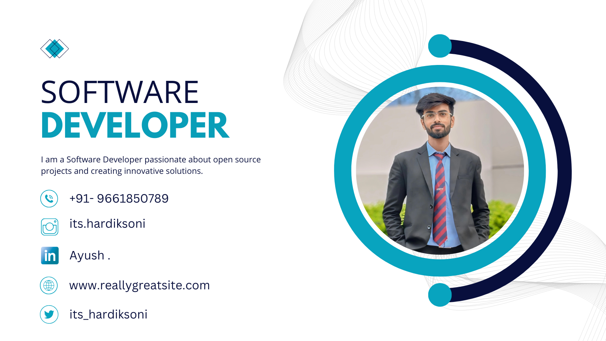

# 👋 Welcome to My GitHub Profile!

## 🚀 About Me
Hi there! I'm *Hardik Soni*, a passionate developer who loves coding, learning new technologies, and contributing to open-source projects. 

- 🔭 I’m currently working on: *Exciting Open-Source Projects*
- 🌱 I’m currently learning: *Cloud Technologies & Kubernetes*
- 💬 Ask me about: *Web Development, Python, or JavaScript*
- 😄 Pronouns: *He/Him*
- ⚡ Fun fact: *I can debug code faster than I can cook a meal!*

---

## 📈 GitHub Stats

---

## 💼 Projects

### Featured Projects
- [Project 1](https://github.com/ItsHardikSoni/project1) - A brief description of the project.
- [Project 2](https://github.com/ItsHardikSoni/project2) - Another cool project to showcase.

### Other Projects
Check out all my repositories [here](https://github.com/ItsHardikSoni?tab=repositories).

---

## 🛠 Skills & Tools
### Languages

### Frameworks & Libraries

### Tools

---

## 🌐 Connect with Me

---

## 💡 Fun Facts
- 🌍 I love exploring new cultures and places.
- 🎮 I’m a huge fan of strategy and puzzle video games.
- 📚 I’ve read over 50 programming books in the last 5 years.

---

## ❤ Support Me
If you like my work, consider buying me a coffee!  

